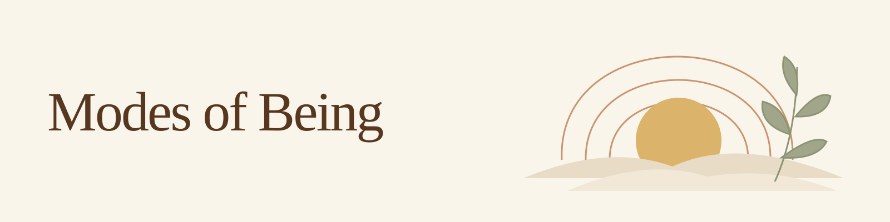

# Modes of Being

A small daily practice: choose how you want to be today, then carry your own words through the day with quiet picture reminders.

It runs through Instinct, a personal assistant you can message. Each morning, it asks two questions and shows a compact calendar agenda. After your answer, it makes one image of your chosen modes and practices, then reuses it for a few quiet reminders.

## Install

Copy the entire body of [AGENT.md](AGENT.md) into your own Instinct and say **"Set this up for me."** It will ask your language and confirm your local schedule.

Already using it? Paste the same file and say **"Update my Modes of Being practice, keeping my own language, modes and schedule."** Ask Instinct to confirm what it actually set up; pasting a file alone does not create reminders. You can change, pause or stop the practice whenever you like.

## More

- [AGENT.md](AGENT.md): the complete, current copy-paste installation instructions and modes list.
- [VERSIONS.md](VERSIONS.md): version log, original packages and preserved commit history.

Inspired by [Satya](https://www.emotion.co.il/), independent of and not affiliated with it. You do not need to know Satya to use this practice.
